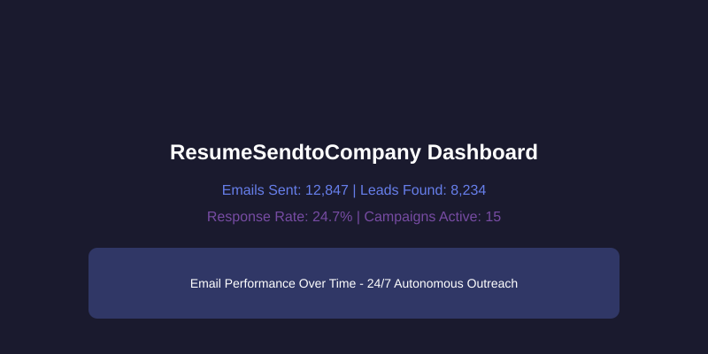

# Autonomous Outreach System

> **AI-assisted lead discovery, personalization, and campaign automation for targeted B2B outreach.**

[](https://nodejs.org/)
[](https://react.dev/)
[](LICENSE)
[](tests/)



## What it does

Autonomous Outreach System brings lead discovery, email verification, AI-assisted personalization, campaign delivery, and campaign analytics into one self-hosted dashboard. It is designed for controlled, transparent outreach workflows where the operator can review leads and configure sending providers before a campaign starts.

The repository includes a Node.js/Express backend, a React/Vite dashboard, SQLite persistence, provider fallback support, email verification, reply monitoring, campaign metrics, and a dead-letter queue for failed work.

## Highlights

- **Lead discovery:** directory, search, and configurable scraping providers.
- **AI personalization:** Gemini and OpenAI integrations with reusable HTML templates.
- **Campaign operations:** dry-run mode, provider selection, rate limits, retries, and progress streams.
- **Email quality controls:** address normalization, verification, bounce tracking, and domain throttling.
- **Operations dashboard:** campaign status, analytics, notifications, provider health, replies, and DLQ management.
- **Self-hosted by default:** SQLite data and local configuration keep deployment simple for a single operator.

## Architecture

```text
┌─────────────────────────────────────────────────────────────┐
│                  Autonomous Outreach System                 │
├──────────────────────────────┬──────────────────────────────┤
│ React + Vite dashboard       │ Node.js + Express API        │
│ campaigns · analytics        │ discovery · AI · sending     │
└──────────────────────────────┴──────────────────────────────┘
                               │
                               ▼
┌──────────────────────────────┬──────────────────────────────┐
│ SQLite                       │ External providers           │
│ leads · sends · replies      │ AI · verification · email    │
│ metrics · notifications      │ scraping · webhooks          │
└──────────────────────────────┴──────────────────────────────┘
```

## Quick start

### Requirements

- Node.js 18 or newer
- npm
- API credentials only for the integrations you plan to enable

### Install and initialize

```bash
git clone https://github.com/semih-kilic/Autonomous-Outreach-System.git
cd Autonomous-Outreach-System
npm ci
npm --prefix frontend-new ci
cp .env.example .env
npm run setup-db
```

`npm run setup-db` creates the local SQLite database under `data/` and applies the application schema. Runtime data, logs, uploads, and local secrets are ignored by Git.

### Run locally

Start the backend:

```bash
npm run dev
```

In a second terminal, start the dashboard:

```bash
npm --prefix frontend-new run dev
```

The Vite development server proxies `/api` requests to `http://localhost:3002`. To create a production frontend bundle, run:

```bash
npm run frontend:build
```

For a single-host PM2 deployment:

```bash
pm2 start ecosystem.config.cjs
pm2 logs autonomous-outreach
```

## Configuration

Copy `.env.example` to `.env` and configure only the services you need. The complete optional configuration surface is documented in [`config.toml.example`](config.toml.example). Do not commit `.env`, `config.toml`, database files, uploaded documents, or provider credentials.

Common integrations include SMTP, Resend, Gemini, OpenAI, ScraperAPI, ScrapingBee, ZenRows, and email verification providers. Keep sending disabled or use dry-run mode until sender identity, provider limits, templates, and target data have been reviewed.

## Useful commands

| Command | Purpose |
|---|---|
| `npm run setup-db` | Create or initialize the local SQLite database |
| `npm run dev` | Start the backend in development mode |
| `npm run frontend:build` | Build the React dashboard for production |
| `npm test` | Run the Node.js test suite |
| `npm run lint` | Run ESLint |
| `pm2 start ecosystem.config.cjs` | Run the backend with PM2 |

## Project structure

```text
.
├── server.js                 # Express API and application wiring
├── db.js                     # SQLite schema and data access helpers
├── config.js                 # Environment/TOML configuration loader
├── send-engine.js            # Main campaign delivery engine
├── scan-engine.js            # Lead discovery engine
├── ai-advisor.js             # AI personalization and reply analysis
├── frontend-new/             # React + Vite dashboard
├── templates/                # HTML campaign templates
├── tests/                    # Node.js tests
├── scripts/setup-db.mjs      # Database initialization command
├── assets/                   # README and social preview assets
├── ecosystem.config.cjs      # PM2 process configuration
├── .env.example              # Safe configuration template
└── README.md
```

## Development status

The project is actively organized around a self-hosted single-operator workflow. The current roadmap is to improve onboarding, expand provider contract tests, add richer campaign review workflows, and make deployment/monitoring more turnkey.

Before enabling live sending, configure a verified sender domain, test in dry-run mode, review generated content, and confirm that your outreach process follows the rules applicable to your recipients and jurisdiction.

## Contributing

Issues and pull requests are welcome. Please read [`CONTRIBUTING.md`](CONTRIBUTING.md), keep changes focused, add tests for behavior changes, and update the README when commands or project structure change.

## Security

Please do not publish credentials or sensitive recipient data in an issue. Report suspected vulnerabilities according to [`SECURITY.md`](SECURITY.md).

## License

This project is released under the [MIT License](LICENSE).
