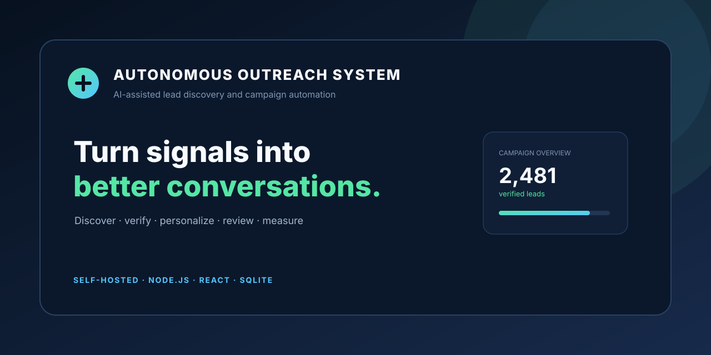
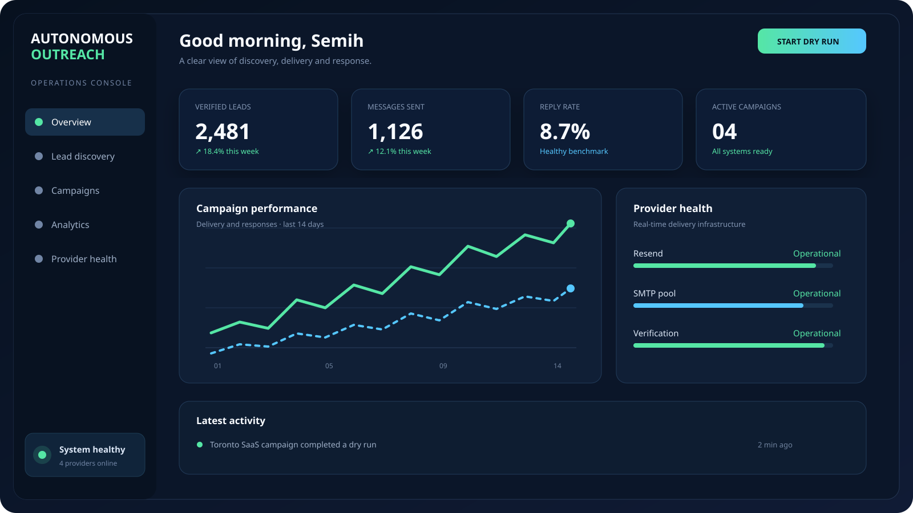
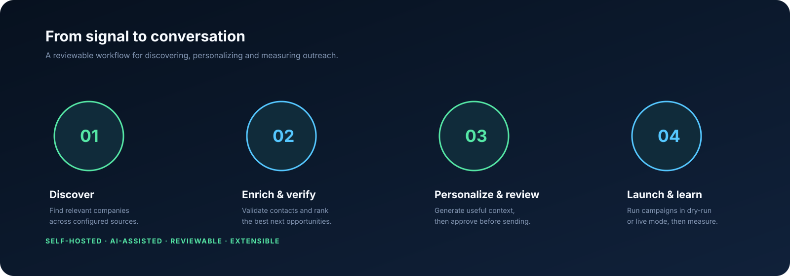

# Autonomous Outreach System

> **Discover better leads. Personalize with context. Launch outreach you can review.**

[](https://github.com/semih-kilic/Autonomous-Outreach-System/actions/workflows/ci.yml)
[](https://nodejs.org/)
[](https://react.dev/)
[](LICENSE)



Autonomous Outreach System is a **self-hosted, AI-assisted B2B outreach workspace** for discovering relevant companies, verifying contacts, generating useful personalization, reviewing campaigns, and measuring responses from one operational dashboard.

It is built for founders, freelancers, and small sales teams that want more control than a black-box outreach platform provides. The system keeps the operator in the loop with dry-run mode, provider visibility, campaign progress, and local SQLite persistence.

## Product tour

### One operational view



The dashboard brings lead quality, campaign delivery, reply performance, and provider health into one view. The included visual is a safe demo illustration using synthetic data; it does not expose credentials or recipient information.

### A reviewable workflow



The intended workflow is simple: **discover → enrich and verify → personalize and review → launch and learn**. Each stage can be inspected before live sending is enabled.

## What it does

| Capability | Outcome |
|---|---|
| **Lead discovery** | Collect relevant companies from configured directories, search sources, and scraping providers. |
| **Enrichment and verification** | Normalize contacts, verify addresses, classify email types, and rank useful leads. |
| **AI personalization** | Generate context-aware introductions using Gemini or OpenAI integrations and reusable templates. |
| **Campaign operations** | Run dry-runs, configure providers, apply rate limits, stream progress, retry failures, and monitor delivery. |
| **Reply and performance tracking** | Follow campaign activity through replies, opens, bounces, analytics, and provider health. |
| **Self-hosted control** | Keep the operational database and configuration local while connecting only the providers you choose. |

## Who it is for

**Founders and freelancers** can use the workspace to organize targeted outreach without stitching together multiple tools. **Small sales and marketing teams** can use it as a transparent campaign console with visible lead and provider state. **Developers** can extend the Node.js, React, and SQLite stack with additional discovery, AI, verification, or delivery providers.

## Quick start

### Requirements

- Node.js 18 or newer
- npm
- API credentials only for the integrations you plan to enable

### Install and initialize

```bash
git clone https://github.com/semih-kilic/Autonomous-Outreach-System.git
cd Autonomous-Outreach-System
npm ci
npm --prefix frontend-new ci
cp .env.example .env
npm run setup-db
```

`npm run setup-db` creates the local SQLite database under `data/` and applies the application schema. Runtime data, logs, uploads, and local secrets are ignored by Git.

### Run locally

Start the backend in one terminal:

```bash
npm run dev
```

Start the dashboard in a second terminal:

```bash
npm --prefix frontend-new run dev
```

The Vite development server proxies `/api` requests to `http://localhost:3002`. To create a production frontend bundle, run:

```bash
npm run frontend:build
```

For a single-host PM2 deployment:

```bash
pm2 start ecosystem.config.cjs
pm2 logs autonomous-outreach
```

## Safe first run

Before connecting live providers, keep sending disabled or use dry-run mode. Configure a verified sender domain, review the generated content, test with synthetic or opted-in data, and confirm that your outreach process follows the rules applicable to your recipients and jurisdiction.

## Configuration

Copy `.env.example` to `.env` and configure only the services you need. The complete optional configuration surface is documented in [`config.toml.example`](config.toml.example). Do not commit `.env`, `config.toml`, database files, uploaded documents, provider credentials, or recipient exports.

Common integrations include SMTP, Resend, Gemini, OpenAI, ScraperAPI, ScrapingBee, ZenRows, and email verification providers. Provider credentials are optional; the dashboard and database setup can be explored before live sending is configured.

## Useful commands

| Command | Purpose |
|---|---|
| `npm run setup-db` | Create or initialize the local SQLite database |
| `npm run dev` | Start the backend in development mode |
| `npm run frontend:build` | Build the React dashboard for production |
| `npm test` | Run the Node.js test suite |
| `npm run lint` | Run ESLint |
| `pm2 start ecosystem.config.cjs` | Run the backend with PM2 |

## Architecture

```text
┌──────────────────────────────────────────────────────────────┐
│                  Autonomous Outreach System                  │
├──────────────────────────────┬───────────────────────────────┤
│ React + Vite dashboard       │ Node.js + Express API         │
│ campaigns · analytics        │ discovery · AI · sending      │
└──────────────────────────────┴───────────────────────────────┘
                               │
                               ▼
┌──────────────────────────────┬───────────────────────────────┐
│ SQLite                       │ External providers            │
│ leads · sends · replies      │ AI · verification · email     │
│ metrics · notifications      │ scraping · webhooks           │
└──────────────────────────────┴───────────────────────────────┘
```

## Project structure

```text
.
├── server.js                 # Express API and application wiring
├── db.js                     # SQLite schema and data access helpers
├── config.js                 # Environment/TOML configuration loader
├── send-engine.js            # Campaign delivery engine
├── scan-engine.js            # Lead discovery engine
├── ai-advisor.js             # AI personalization and reply analysis
├── frontend-new/             # React + Vite dashboard
├── templates/                # HTML campaign templates
├── tests/                    # Node.js tests
├── scripts/setup-db.mjs      # Database initialization command
├── assets/                   # README and social preview assets
├── ecosystem.config.cjs      # PM2 process configuration
├── .github/workflows/ci.yml  # Pull request and main-branch checks
└── README.md
```

## Roadmap

| Status | Focus |
|---|---|
| **Available** | Lead discovery, email verification, AI-assisted personalization, campaign delivery, provider fallback, analytics, replies, DLQ, SQLite persistence, and React dashboard. |
| **Next** | Seed/demo mode, richer campaign review, provider contract tests, and more polished first-run onboarding. |
| **Later** | Multi-user authentication, hosted deployment presets, granular permissions, and expanded observability. |

## Development status

The project is organized around a self-hosted single-operator workflow. Pull requests run install, database setup, backend tests, lint, and frontend build through GitHub Actions. See [`CHANGELOG.md`](CHANGELOG.md) for the current release history.

## Contributing

Issues and pull requests are welcome. Please read [`CONTRIBUTING.md`](CONTRIBUTING.md), keep changes focused, add tests for behavior changes, and update the README when commands or project structure change.

## Security

Please do not publish credentials or sensitive recipient data in an issue. Review [`SECURITY.md`](SECURITY.md) before connecting live providers.

## License

This project is released under the [MIT License](LICENSE).
